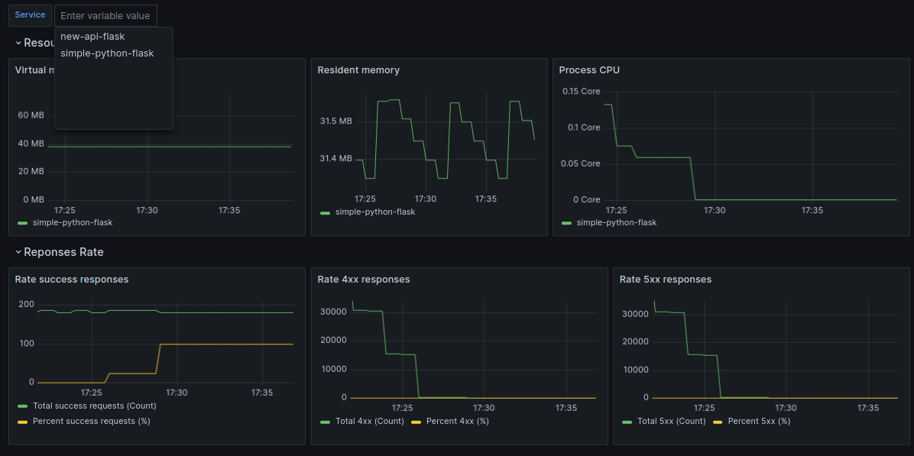

### Readme
- Since i didn't find any good dashboard exists for this: https://github.com/pilosus/flask_prometheus_metrics , i have to create new dashboard xD
- What it looks like?

- How to config job in prometheus?. Label is needed for filter, the name you set is your `serviceName`. label `flask` is just for fixed label that we are know job for flask api with `flask_prometheus_metrics`
```
scrape_configs:
  - job_name: simple-python-flask
    static_configs:
      - targets:
        - '10.0.0.1:31000'
        labels:
          service: flask
          serviceName: simple-python-flask
    basic_auth:
      username: 'user'
      password: 'password'

  - job_name: new-api-flask
    static_configs:
      - targets:
        - '10.0.0.2:32000'
        labels:
          service: flask
          serviceName: new-api-flask
    basic_auth:
      username: 'user'
      password: 'password'
```

- Query example
```
### Resource Usage ###
# Virtual memory
process_virtual_memory_bytes{serviceName="$Service"} / 1024 / 1024
# Resident memory
process_resident_memory_bytes{serviceName="$Service"} / 1024 / 1024
# Process CPU
avg(rate(process_cpu_seconds_total{serviceName="$Service"}[$__range]))

### Reponses Rate ###
# Rate success responses
sum(increase(flask_http_request_total{status!~"4..|5.."}[$__range]))
(sum(rate(flask_http_request_total{status!~"4..|5.."}[$__range]))  /  sum(rate(flask_http_request_total[$__range]))) * 100
# Rate 4xx responses
sum(increase(flask_http_request_total{status=~"4.."}[$__range]))
(sum(rate(flask_http_request_total{status=~"4.."}[$__range])) / sum(rate(flask_http_request_total[$__range]))) * 100
# Rate 5xx responses
sum(increase(flask_http_request_total{status=~"5.."}[$__range]))
(sum(rate(flask_http_request_total{status=~"5.."}[$__range])) / sum(rate(flask_http_request_total[$__range]))) * 100
```